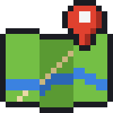

<p align="center">
  
</p>

<h1 align="center">geomaptools</h1>

Minecraft Spigot plugin for geographic map import, image import, and quick building.

## Overview

geomaptools brings the real world — or your own plans — into Minecraft. It lays a map
on the ground as a guide, so you can rebuild your town, your school or a whole city
quarter to scale without measuring anything by hand.

- **Real-world maps** — `/gOSMOverpass` downloads roads and paths from OpenStreetMap
  around any latitude/longitude and draws them as glowstone lines around you.
- **Images and plans** — `/gmap` turns a PNG (a city plan, a floor plan, a pixel
  picture) into colored blocks, flat on the ground or as a standing wall.
- **Quick building** — trace the map with trails (`/gspur`), raise walls along an
  outline (`/gbuildalong`), build blocks and walls in one step (`/gquad`, `/gforward`)
  and clean up again with a flood-fill delete (`/gdelete`).

A typical workflow: import the map, trace the outlines you want, raise them into walls,
then remove the guide lines — see [Typical Workflow](#typical-workflow-importing-a-real-world-map).

Runs on **Spigot 1.21.11** (Java 21) and **Spigot 26.3** (Java 25).

---

## Installation

1. Download the jar for your server from the [Releases](https://github.com/cndrbrbr/geomaptools/releases) page —
   each Minecraft version has its own release (`v<version>-mc1.21.11` or `v<version>-mc26.3`) —
   and copy it into your server's `plugins/` folder.
2. Start the server — `plugins/geomaptools/config.yml` will be created automatically.
3. Set the image path in `config.yml`:
   ```yaml
   geo:
     path: /path/to/your/images/
   ```
4. Assign permissions (see below).

---

## Permissions

| Permission | Commands |
|---|---|
| `geomaptools.basic` | `gspur`, `goff`, `gquad`, `gforward`, `gOSMOverpass`, `gspawnColorSheeps` |
| `geomaptools.advanced` | `gmap`, `gload`, `glist`, `gdelete`, `gbuildalong` |

---

## Commands

### `/goff`
Turns off whichever geomaptools command is currently active for you.

```
/goff
```

---

### `/gspur [material] [height]`
Leaves a trail of blocks beneath you as you walk. Every step places a block one level below your feet.

**Parameters:**
- `material` — block to use (see material list below). Default: `gold`
- `height` — how many layers high the trail is. Default: `1`

**Example — walk a gold trail:**
```
/gspur gold
```

**Example — walk a raised coal wall, 3 blocks tall:**
```
/gspur coal 3
```

**Special case — `poweredrail`:**
The trail places a powered rail on top of a redstone block automatically, ready to use with a minecart.

**To stop trailing:** `/goff`

---

### `/gquad [material] [width] [height] [depth]`
Places a solid rectangular block structure at the next block you place, oriented in the direction you are facing.

**Parameters:**
- `material` — block material. Default: `gold`
- `width` — size left/right. Default: `4`
- `height` — size up/down. Default: `4`
- `depth` — size forward. Default: `4`

**Example — place a 6×3×1 glass wall in front of you:**
```
/gquad glass 6 3 1
```

Then place any block — the structure appears at that position facing the direction you were looking.

**To cancel:** `/goff`

---

### `/gforward [material] [length] [height]`
Builds a wall straight ahead of you from the next block you place.

**Parameters:**
- `material` — block material. Default: `gold`
- `length` — how far forward the wall extends. Default: `10`
- `height` — how tall the wall is. Default: `2`

**Example — build a 15-block long, 4-block tall diamond wall:**
```
/gforward diamond 15 4
```

Place a block to trigger it — the wall builds out in the direction you are facing.

**To cancel:** `/goff`

---

### `/gdelete [radius]`
Removes all connected blocks of the same material as the block you place next, within the given radius. Like a flood-fill delete.

**Parameters:**
- `radius` — maximum reach from the starting block. Default: `10`

**Example — clear a region of glass blocks within radius 20:**
```
/gdelete 20
```

Hold the same material in your hand, then place a block — all touching blocks of that type within the radius are removed.

**To cancel:** `/goff`

---

### `/gbuildalong [radius] [height]`
Builds a wall on top of all connected blocks of the same material as the block you place, within the given radius. Useful for raising a wall along an existing outline.

**Parameters:**
- `radius` — how far the builder searches along the surface. Default: `10`
- `height` — how many blocks tall to build up. Default: `2`

**Example — raise a 3-block tall wall along all connected gold blocks within radius 15:**
```
/gbuildalong 15 3
```

Place a block on your outline — the walls grow upward along it.

**To cancel:** `/goff`

---

### `/glist`
Lists all image files (`.PNG`) available in the configured image directory.

```
/glist
```

The names shown can be used with `/gmap`.

---

### `/gmap [filename] [ground]`
Places an image from your image directory into the world as colored wool or terracotta blocks, one pixel per block. Triggered when you place the next block.

**Parameters:**
- `filename` — name of the image file (e.g. `MyMap.PNG`). Default: `Minion.PNG`
- `ground` — `true` to lay the image flat on the ground, `false` to place it as a standing wall. Default: `false`

**Example — place an image flat on the ground:**
```
/gmap CityPlan.PNG true
```

**Example — place an image as a standing picture:**
```
/gmap Portrait.PNG false
```

Place a block at the corner where you want the image to start. The image expands from that point.

> **Tip:** Use `/glist` first to see available filenames.
> **Tip:** Use `/gdelete` to remove an image you no longer need.

**To cancel:** `/goff`

---

### `/gOSMOverpass <size> <lat> <lon>`
Imports a real-world map from **OpenStreetMap** (via the Overpass API) and draws it as glowstone blocks in the world. Roads and paths are drawn relative to your current position.

**Parameters:**
- `size` — area to import in meters (width and depth). Recommended: `500`–`2000`
- `lat` — latitude of the center of the area (decimal degrees)
- `lon` — longitude of the center of the area (decimal degrees)

**Example — import 1000m around Paris:**
```
/gOSMOverpass 1000 48.8566 2.3522
```

**Example — import 500m around Bonn, Germany:**
```
/gOSMOverpass 500 50.735 7.101
```

Stand at the point you want to be the map origin, then run the command. The download runs in the background — you will receive a chat message when the import is done and how many ways were placed.

> **Note:** Requires an internet connection. Use at least `500` for size — smaller areas may have no roads and produce an empty result.

---

### `/gspawnColorSheeps [count] [color]`
Spawns a grid of sheep near you. Useful for testing wool colors or just for fun.

**Parameters:**
- `count` — total number of sheep to spawn (2–100)
- `color` — wool color name, or `all` to spawn rainbow `jeb_` sheep. Default: `all`

**Available colors:**
`WHITE` `ORANGE` `MAGENTA` `LIGHT_BLUE` `YELLOW` `LIME` `PINK` `GRAY` `LIGHT_GRAY` `CYAN` `PURPLE` `BLUE` `BROWN` `GREEN` `RED` `BLACK`

**Example — spawn 16 blue sheep:**
```
/gspawnColorSheeps 16 BLUE
```

**Example — spawn 20 rainbow jeb_ sheep:**
```
/gspawnColorSheeps 20 all
```

---

## Material Names

These names are used as the `material` parameter in `gspur`, `gquad`, `gforward`, etc.:

| Name | Block |
|---|---|
| `coal` | Coal Block |
| `gold` | Gold Block |
| `diamond` | Diamond Block |
| `dirt` | Dirt |
| `fence` | Oak Fence |
| `glass` | Glass |
| `sand` | Sand |
| `grass` | Grass Block |
| `redstoneblock` | Redstone Block |
| `glowstone` | Glowstone |
| `gravel` | Gravel |
| `poweredrail` | Powered Rail (on Redstone Block) |
| `potato` | Potato (crop) |
| `apple` | Apple |

---

## Typical Workflow: Importing a Real-World Map

1. Set your image path in `config.yml`.
2. Export a map section from OpenStreetMap as an image, or use `/gOSMOverpass` for a live import.
3. Run `/gmap MyCity.PNG true` and place a block at your starting corner — the map appears as a flat ground overlay.
4. Walk along the roads and outlines using `/gspur` to trace paths.
5. Use `/gbuildalong` to raise walls along traced outlines.
6. Use `/gdelete` to clean up the guide overlay when done.

---

## Building with pom.xml

```bash
mvn package               # Spigot 1.21.11 → target/geomaptools-<version>-mc1.21.11.jar
mvn package -P mc-26.3    # Spigot 26.3    → target/geomaptools-<version>-mc26.3.jar
```

Copy the jar to your server's `plugins/` folder. Building the `mc-26.3` profile needs JDK 25+.

CI builds both jars on every push. A tag `v<version>-mc<minecraft>` (e.g. `v4.37-mc26.3`)
publishes a separate GitHub Release containing only the jar for that Minecraft version.
